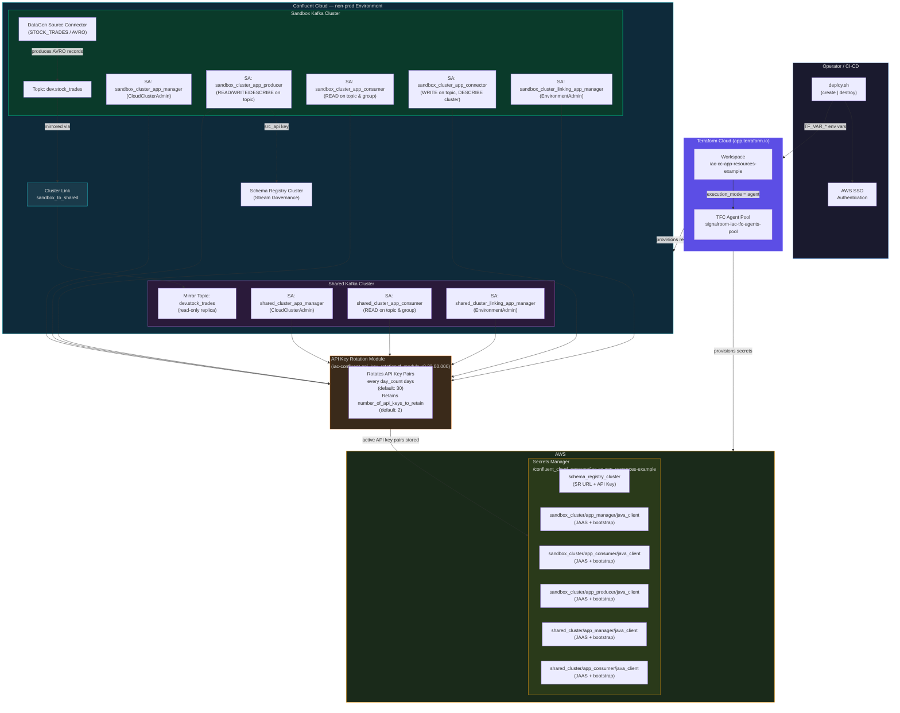

# IaC Confluent Cloud Application Resources Example
Infrastructure-as-Code (IaC) example demonstrating Confluent Cloud Cluster Linking between a Sandbox and a Shared Kafka cluster, with automated API key rotation, AVRO schema governance, and secrets stored in AWS Secrets Manager, all managed via Terraform Cloud.

Below is the Terraform resource visualization of the infrastructure that's created:


**Table of Contents**
<!-- toc -->
- [**1.0 Overview**](#10-overview)
- [**2.0 Architecture Overview**](#20-architecture-overview)
- [**3.0 Why the Private Connectivity Configuration Lives in a Separate Workspace**](#30-why-the-private-connectivity-configuration-lives-in-a-separate-workspace)
    + [**3.1. Different Lifecycles**](#31-different-lifecycles)
    + [**3.2. Different Blast Radius**](#32-different-blast-radius)
    + [**3.3. Different Permission Boundaries**](#33-different-permission-boundaries)
    + [**3.4. Team Ownership Alignment**](#34-team-ownership-alignment)
    + [**3.5. Dependency Ordering Without Tight Coupling**](#35-dependency-ordering-without-tight-coupling)
- [**4.0 What This Workspace Provisions**](#40-what-this-workspace-provisions)
- [**5.0 Let's Get Started**](#50-lets-get-started)
  - [**5.1 Deploy the Infrastructure**](#51-deploy-the-infrastructure)
  - [**5.2 Teardown the Infrastructure**](#52-teardown-the-infrastructure)
- [**6.0 Resources**](#60-resources)
  - [**6.1 Terminology**](#61-terminology)
  - [**6.2 Related Documentation**](#62-related-documentation)
<!-- tocstop -->

## **1.0 Overview**
This project automates the end-to-end provisioning of a **Confluent Cloud Cluster Linking pattern** in a non-production environment. A **DataGen Source Connector** continuously produces synthetic stock-trade events (AVRO format) to a topic on the **Sandbox cluster**. A **Cluster Link** replicates that topic in real time to the **Shared cluster**, where downstream consumers can read it without direct access to the source cluster.

All credentials are:

- **Automatically rotated** on a configurable schedule using the [`iac-confluent-api_key_rotation-tf_module`](https://github.com/j3-signalroom/iac-confluent-api_key_rotation-tf_module).
- **Persisted to AWS Secrets Manager** in a format ready for Java Kafka clients (SASL/JAAS) and Schema Registry clients.

Infrastructure state is managed in **Terraform Cloud** (organization: `signalroom`, workspace: `iac-cc-app-resources-example`) using a dedicated **TFC Agent Pool** for secure, private execution.

## **2.0 Architecture Overview**
The diagram below illustrates the full resource topology provisioned by this configuration:



**Data Flow Summary:**

1. **DataGen Connector** → produces synthetic `STOCK_TRADES` events (AVRO) → `dev.stock_trades` topic on the Sandbox cluster.
2. **Cluster Link (sandbox_to_shared)** → mirrors `dev.stock_trades` from Sandbox → Shared cluster as a read-only mirror topic.
3. **Shared cluster consumers** → read from the mirror topic without needing any access to the Sandbox cluster.
4. **Schema Registry** (shared across both clusters in the non-prod environment) → validates AVRO schemas.

## **3.0 Why the Private Connectivity Configuration Lives in a Separate Workspace**
The two types of AWS private connectivity networking infrastructure are intentionally managed in separate Terraform Cloud workspaces:

- [`iac-cc-aws-privatelink-infrastructure-networking-example`](https://github.com/j3-signalroom/iac-cc-aws_privatelink-infrastructure_networking-example)
- [`iac-cc-aws-pni-infrastructure-networking-example`](https://github.com/j3-signalroom/iac-cc-aws_pni-infrastructure_networking-example)
    
These are separated from this application-resources workspace (`iac-cc-app-resources-example`). There are several important reasons for this separation:

### **3.1. Different Lifecycles**
Network infrastructure (VPCs, subnets, PrivateLink endpoint services, VPC endpoints, DNS hosted zones) changes infrequently, often only at initial setup or during major topology changes. Application resources such as service accounts, API keys, ACLs, topics, connectors, and cluster links change much more frequently as teams iterate on their streaming workloads. Coupling them together would force unnecessary plan/apply cycles on stable networking resources every time an application-level change is needed.

### **3.2. Different Blast Radius**
A misconfigured Terraform apply against networking resources could sever private connectivity for every service account and application relying on the cluster. By isolating networking in its own workspace, accidental disruption from application-layer changes is impossible, and vice versa. Each workspace has its own state file, so a corrupted or rolled-back state in one workspace cannot cascade into the other.

### **3.3. Different Permission Boundaries**
Private connectivity provisioning requires elevated AWS permissions (creating VPC endpoints, modifying route tables, managing private hosted zones) and Confluent Cloud permissions (accepting private connectivity connections on enterprise clusters). Application resources require only Confluent Cloud service-account-level permissions and limited AWS access for Secrets Manager. Splitting the workspaces allows tighter IAM scoping, the application workspace's Terraform Cloud agent needs only `secretsmanager:*` on a narrow path, not broad VPC/EC2 permissions.

### **3.4. Team Ownership Alignment**
In many organizations, a platform or network engineering team owns the private connectivity setup, while application or data engineering teams own the Kafka resources layered on top. Separate workspaces map cleanly to separate code repositories, PR review cycles, and on-call responsibilities.

### **3.5. Dependency Ordering Without Tight Coupling**
This workspace references the already-provisioned clusters by their IDs (passed in as input variables). It does not create the clusters or their private connectivity connections, it simply consumes them as data sources. This loose coupling means the private connectivity workspace can be applied first (and independently validated) before this workspace is ever initialized.

## **4.0 What This Workspace Provisions**
| Layer | Resources |
|-------|-----------|
| **Sandbox Kafka Cluster** | Service accounts (`app_manager`, `app_producer`, `app_consumer`, `app_connector`), role bindings, ACLs, the `dev.stock_trades` topic, a DataGen Source connector, and rotating API key pairs for each service account |
| **Shared Kafka Cluster** | Service accounts (`app_manager`, `app_consumer`), role bindings, ACLs, and rotating API key pairs |
| **Cluster Linking** | A bidirectional cluster link between Sandbox and Shared, plus a mirror topic (`dev.stock_trades`) on the Shared cluster |
| **Schema Registry** | Service account, DeveloperRead/DeveloperWrite role bindings on all subjects, and a rotating API key pair |
| **AWS Secrets Manager** | Six secrets storing JAAS credentials and bootstrap server URIs for Java Kafka clients |
| **Terraform Cloud** | Workspace configuration to run on a TFC agent pool (`signalroom-iac-tfc-agents-pool`) |

## **5.0 Let's Get Started**

### **5.1 Deploy the Infrastructure**
The deploy.sh script handles authentication and Terraform execution: 

```bash
./deploy.sh create --profile=<SSO_PROFILE_NAME> \
                   --confluent-api-key=<CONFLUENT_API_KEY> \
                   --confluent-api-secret=<CONFLUENT_API_SECRET> \
                   --tfe-token=<TFE_TOKEN> \
                   --confluent-environment-id=<CONFLUENT_ENVIRONMENT_ID> \
                   --confluent-sandbox-kafka-cluster-id=<CONFLUENT_SANDBOX_KAFKA_CLUSTER_ID> \
                   --confluent-shared-kafka-cluster-id=<CONFLUENT_SHARED_KAFKA_CLUSTER_ID> \
                   [--confluent-access-code-id=<CONFLUENT_ACCESS_CODE_ID>] \
                   [--day-count=<DAY_COUNT>]
```

Here's the argument table for `deploy.sh create` command:

| Argument | Required | Description |
|---|---|---|
| `--profile` | ✅ | The AWS SSO profile name. Passed directly to `aws sso login` and `aws2-wrap` for authentication, and used to resolve `AWS_REGION`, `AWS_ACCESS_KEY_ID`, `AWS_SECRET_ACCESS_KEY`, and `AWS_SESSION_TOKEN`, which are then exported as `TF_VAR_aws_region`, `TF_VAR_aws_access_key_id`, `TF_VAR_aws_secret_access_key`, and `TF_VAR_aws_session_token` for Terraform, respectively. |
| `--confluent-api-key` | ✅ | Confluent Cloud API key. Exported as `TF_VAR_confluent_api_key` for Terraform. |
| `--confluent-api-secret` | ✅ | Confluent Cloud API secret. Exported as `TF_VAR_confluent_api_secret` for Terraform. |
| `--tfe-token` | ✅ | Terraform Enterprise/Cloud API token. Exported as `TF_VAR_tfe_token` — used for authenticating the TFC Agent or remote backend. |
| `--confluent-environment-id` | ✅ | Confluent Cloud environment ID where the clusters are provisioned. Exported as `TF_VAR_confluent_environment_id` for Terraform. | |
| `--confluent-sandbox-kafka-cluster-id` | ✅ | Confluent Cloud Kafka cluster ID for the Sandbox (source) cluster. Exported as `TF_VAR_confluent_sandbox_kafka_cluster_id` for Terraform. |
| `--confluent-shared-kafka-cluster-id` | ✅ | Confluent Cloud Kafka cluster ID for the Shared (destination) cluster. Exported as `TF_VAR_confluent_shared_kafka_cluster_id` for Terraform. |
| `--confluent-access-code-id` | ❌ | Confluent Cloud access code ID. Exported as `TF_VAR_confluent_access_code_id` for Terraform. _This is required only if you're using the Confluent Private Network Interface (PNI) for private network connectivity to the Confluent Cloud environment._ |
| `--day-count` | ❌ | API key rotation interval in days. Exported as `TF_VAR_day_count`. |

> All 7 arguments are required — the script exits with code `85` if any are missing.

### **5.2 Teardown the Infrastructure**
```bash
./deploy.sh destroy --profile=<SSO_PROFILE_NAME> \
                    --confluent-api-key=<CONFLUENT_API_KEY> \
                    --confluent-api-secret=<CONFLUENT_API_SECRET> \
                    --tfe-token=<TFE_TOKEN> \
                    --confluent-environment-id=<CONFLUENT_ENVIRONMENT_ID> \
                    --confluent-sandbox-kafka-cluster-id=<CONFLUENT_SANDBOX_KAFKA_CLUSTER_ID> \
                    --confluent-shared-kafka-cluster-id=<CONFLUENT_SHARED_KAFKA_CLUSTER_ID>
```

Here's the argument table for `deploy.sh destroy` command:

| Argument | Required | Description |
|---|---|---|
| `--profile` | ✅ | The AWS SSO profile name. Passed directly to `aws sso login` and `aws2-wrap` for authentication, and used to resolve `AWS_REGION`, `AWS_ACCESS_KEY_ID`, `AWS_SECRET_ACCESS_KEY`, and `AWS_SESSION_TOKEN`, which are then exported as `TF_VAR_aws_region`, `TF_VAR_aws_access_key_id`, `TF_VAR_aws_secret_access_key`, and `TF_VAR_aws_session_token` for Terraform, respectively. |
| `--confluent-api-key` | ✅ | Confluent Cloud API key. Exported as `TF_VAR_confluent_api_key` for Terraform. |
| `--confluent-api-secret` | ✅ | Confluent Cloud API secret. Exported as `TF_VAR_confluent_api_secret` for Terraform. |
| `--tfe-token` | ✅ | Terraform Enterprise/Cloud API token. Exported as `TF_VAR_tfe_token` — used for authenticating the TFC Agent or remote backend. |
| `--confluent-environment-id` | ✅ | Confluent Cloud environment ID where the clusters are provisioned. Exported as `TF_VAR_confluent_environment_id` for Terraform. | |
| `--confluent-sandbox-kafka-cluster-id` | ✅ | Confluent Cloud Kafka cluster ID for the Sandbox (source) cluster. Exported as `TF_VAR_confluent_sandbox_kafka_cluster_id` for Terraform. |
| `--confluent-shared-kafka-cluster-id` | ✅ | Confluent Cloud Kafka cluster ID for the Shared (destination) cluster. Exported as `TF_VAR_confluent_shared_kafka_cluster_id` for Terraform. |
| `--confluent-access-code-id` | ❌ | Confluent Cloud access code ID. Exported as `TF_VAR_confluent_access_code_id` for Terraform. _This is required only if you're using the Confluent Private Network Interface (PNI) for private network connectivity to the Confluent Cloud environment._ |

> All 7 arguments are required — the script exits with code `85` if any are missing.

## **6.0 Resources**

### **6.1 Terminology**
- **ACL**: Access Control List - A list of permissions attached to an object that specifies which users or system processes can access the object and what operations they can perform.
- **AWS**: Amazon Web Services - A comprehensive cloud computing platform provided by Amazon.
- **CC**: Confluent Cloud - A fully managed event streaming platform based on Apache Kafka.
- **IaC**: Infrastructure as Code - The practice of managing and provisioning computing infrastructure through machine-readable definition files.
- **JAAS**: Java Authentication and Authorization Service - A Java security framework for user authentication and authorization.
- **PNI**: Private Network Interface - A method of connecting to Confluent Cloud that provides private connectivity without traversing the public internet.
- **TFC**: Terraform Cloud - A service that provides infrastructure automation using Terraform.
- **VPC**: Virtual Private Cloud - A virtual network dedicated to your AWS account.

### **6.2 Related Documentation**
- [Geo-replication with Cluster Linking on Confluent Cloud](https://docs.confluent.io/cloud/current/multi-cloud/cluster-linking/index.html#geo-replication-with-cluster-linking-on-ccloud)
