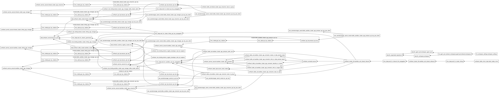

# IaC Confluent Cloud Application Resources Example
This Terraform repo provisions the application-layer resources required to demonstrate Confluent Cloud Cluster Linking between two Kafka clusters, a Sandbox (source) cluster and a Shared (destination) cluster, within a single Confluent Cloud environment. All API key credentials are automatically rotated on a configurable schedule and securely stored in AWS Secrets Manager for consumption by Java-based Kafka clients.

Below is the Terraform resource visualization of the infrastructure that's created:



**Table of Contents**
<!-- toc -->
- [1.0 Architecture Overview](#10-architecture-overview)
- [2.0 Why the PrivateLink Configuration Lives in a Separate Workspace](#20-why-the-privatelink-configuration-lives-in-a-separate-workspace)
    + [2.1. Different Lifecycles](#21-different-lifecycles)
    + [2.2. Different Blast Radius](#22-different-blast-radius)
    + [2.3. Different Permission Boundaries](#23-different-permission-boundaries)
    + [2.4. Team Ownership Alignment](#24-team-ownership-alignment)
    + [2.5. Dependency Ordering Without Tight Coupling](#25-dependency-ordering-without-tight-coupling)
- [3.0 What This Workspace Provisions](#30-what-this-workspace-provisions)
- [4.0 Let's Get Started](#40-lets-get-started)
  - [4.1 Deploy the Infrastructure](#41-deploy-the-infrastructure)
    - [4.1.1 Handling DNS Resolution Errors](#411-handling-dns-resolution-errors)
    - [4.1.2 Cluster Linking Error](#412-cluster-linking-error)
  - [4.2 Teardown the Infrastructure](#42-teardown-the-infrastructure)
    - [4.2.1 Handling Cluster Link Deletion Error(s)](#421-handling-cluster-link-deletion-errors)
- [5.0 Resources](#50-resources)
  - [5.1 Terminology](#51-terminology)
  - [5.2 Related Documentation](#52-related-documentation)
<!-- tocstop -->

## **1.0 Architecture Overview**
Below is the full topology of the infrastructure provisioned by this Terraform codebase, which is designed to demonstrate Confluent Cloud Cluster Linking and API key rotation with AWS Secrets Manager.

```mermaid
---
title: "Confluent Cloud Cluster Linking with AWS PrivateLink — Architecture"
---
graph TB
    %% ── Styling ──────────────────────────────────────────────
    classDef confluent fill:#172554,stroke:#1e40af,color:#fff
    classDef kafka fill:#1e3a5f,stroke:#3b82f6,color:#fff
    classDef sa fill:#0f4c75,stroke:#6dd5ed,color:#fff
    classDef topic fill:#1a535c,stroke:#4ecdc4,color:#fff
    classDef connector fill:#6b21a8,stroke:#a78bfa,color:#fff
    classDef aws fill:#ff9900,stroke:#cc7a00,color:#fff
    classDef secret fill:#d97706,stroke:#f59e0b,color:#fff
    classDef tfc fill:#7c3aed,stroke:#a78bfa,color:#fff
    classDef link fill:#059669,stroke:#34d399,color:#fff
    classDef sr fill:#0e7490,stroke:#22d3ee,color:#fff
    classDef mirror fill:#065f46,stroke:#6ee7b7,color:#fff

    %% ── Confluent Cloud Environment ─────────────────────────
    subgraph CC["Confluent Cloud Environment (non-prod)"]
        direction TB

        %% ── Schema Registry ─────────────────────────────────
        subgraph SRCluster["Schema Registry Cluster"]
            SR_API["src_api<br/><i>Service Account</i>"]:::sa
            SR_RB_R["DeveloperRead<br/><i>all subjects</i>"]
            SR_RB_W["DeveloperWrite<br/><i>all subjects</i>"]
            SR_API --> SR_RB_R
            SR_API --> SR_RB_W
        end
        SRCluster:::sr

        %% ── Sandbox Cluster (Source) ────────────────────────
        subgraph Sandbox["Sandbox Kafka Cluster — Source"]
            direction TB

            SB_MGR["sandbox_cluster_app_manager<br/><i>CloudClusterAdmin</i>"]:::sa
            SB_PROD["sandbox_cluster_app_producer<br/><i>Service Account</i>"]:::sa
            SB_CONS["sandbox_cluster_app_consumer<br/><i>Service Account</i>"]:::sa
            SB_CONN_SA["sandbox_cluster_app_connector<br/><i>Service Account</i>"]:::sa

            SB_TOPIC["dev-stock_trades<br/><i>Kafka Topic</i>"]:::topic

            DATAGEN["DataGen Source Connector<br/><i>STOCK_TRADES / AVRO</i>"]:::connector

            SB_ACL_PROD["ACLs: READ, WRITE, DESCRIBE<br/><i>on dev-stock_trades</i>"]
            SB_ACL_CONS_T["ACL: READ<br/><i>on dev-stock_trades</i>"]
            SB_ACL_CONS_G["ACL: READ<br/><i>on consumer group</i>"]
            SB_ACL_CONN["ACLs: DESCRIBE cluster,<br/>WRITE + CREATE topics"]

            SB_PROD --> SB_ACL_PROD --> SB_TOPIC
            SB_CONS --> SB_ACL_CONS_T --> SB_TOPIC
            SB_CONS --> SB_ACL_CONS_G
            SB_CONN_SA --> SB_ACL_CONN --> SB_TOPIC
            DATAGEN -->|"produces AVRO"| SB_TOPIC
        end
        Sandbox:::kafka

        %% ── Shared Cluster (Destination) ────────────────────
        subgraph Shared["Shared Kafka Cluster — Destination"]
            direction TB

            SH_MGR["shared_cluster_app_manager<br/><i>CloudClusterAdmin</i>"]:::sa
            SH_CONS["shared_cluster_app_consumer<br/><i>Service Account</i>"]:::sa

            MIRROR["dev-stock_trades<br/><i>Mirror Topic</i>"]:::mirror

            SH_ACL_CONS_G["ACL: READ<br/><i>on consumer group</i>"]

            SH_CONS --> SH_ACL_CONS_G
            SH_CONS -.->|"consumes"| MIRROR
        end
        Shared:::kafka

        %% ── Cluster Linking ─────────────────────────────────
        subgraph CLinking["Bidirectional Cluster Link"]
            direction LR
            CL_SB_SA["sandbox_cluster_linking_app_manager<br/><i>EnvironmentAdmin</i>"]:::sa
            CL_SH_SA["shared_cluster_linking_app_manager<br/><i>EnvironmentAdmin</i>"]:::sa
            CL_OUT["Outbound Link<br/><i>Sandbox → Shared</i>"]:::link
            CL_IN["Inbound Link<br/><i>Shared → Sandbox</i>"]:::link
            CL_SB_SA --> CL_OUT
            CL_SH_SA --> CL_IN
        end
    end
    CC:::confluent

    %% ── Cluster Link connections ─────────────────────────────
    SB_TOPIC ===>|"replicates via<br/>cluster link"| MIRROR
    CL_OUT -.-> Sandbox
    CL_OUT -.-> Shared
    CL_IN -.-> Shared
    CL_IN -.-> Sandbox

    %% ── AWS Secrets Manager ──────────────────────────────────
    subgraph AWS["AWS Account"]
        direction TB

        subgraph SM["AWS Secrets Manager"]
            direction TB
            SEC_SR["schema_registry_cluster<br/><i>URL + basic auth</i>"]:::secret
            SEC_SB_MGR["sandbox_cluster/<br/>app_manager/java_client"]:::secret
            SEC_SB_CONS["sandbox_cluster/<br/>app_consumer/java_client"]:::secret
            SEC_SB_PROD["sandbox_cluster/<br/>app_producer/java_client"]:::secret
            SEC_SH_MGR["shared_cluster/<br/>app_manager/java_client"]:::secret
            SEC_SH_CONS["shared_cluster/<br/>app_consumer/java_client"]:::secret
        end
        SM:::aws
    end

    %% ── Secret wiring ────────────────────────────────────────
    SR_API -->|"API key stored"| SEC_SR
    SB_MGR -->|"JAAS config stored"| SEC_SB_MGR
    SB_CONS -->|"JAAS config stored"| SEC_SB_CONS
    SB_PROD -->|"JAAS config stored"| SEC_SB_PROD
    SH_MGR -->|"JAAS config stored"| SEC_SH_MGR
    SH_CONS -->|"JAAS config stored"| SEC_SH_CONS

    %% ── Terraform Cloud ──────────────────────────────────────
    subgraph TFC["Terraform Cloud"]
        direction LR
        TFC_ORG["signalroom<br/><i>Organization</i>"]:::tfc
        TFC_WS["iac-cc-app-resources-example<br/><i>Workspace</i>"]:::tfc
        TFC_AP["signalroom-iac-tfc-agents-pool<br/><i>Agent Pool</i>"]:::tfc
        TFC_ORG --- TFC_WS
        TFC_WS -->|"execution mode: agent"| TFC_AP
    end

    %% ── API Key Rotation Module ──────────────────────────────
    ROTATION["iac-confluent-api_key_rotation-tf_module<br/><i>v0.23.00.000</i><br/>Rotates keys every N days,<br/>retains M keys"]
    ROTATION -.->|"manages keys for"| SB_MGR
    ROTATION -.->|"manages keys for"| SB_PROD
    ROTATION -.->|"manages keys for"| SB_CONS
    ROTATION -.->|"manages keys for"| SH_MGR
    ROTATION -.->|"manages keys for"| SH_CONS
    ROTATION -.->|"manages keys for"| CL_SB_SA
    ROTATION -.->|"manages keys for"| CL_SH_SA
    ROTATION -.->|"manages keys for"| SR_API
```



The **Schema Registry** cluster is shared across the environment and its credentials are also stored in AWS Secrets Manager.

## **2.0 Why the PrivateLink Configuration Lives in a Separate Workspace**
The AWS PrivateLink networking infrastructure is intentionally managed in its own Terraform Cloud workspace (`iac-cc-aws-privatelink-infrastructure-networking-example`), separate from this application-resources workspace (`iac-cc-app-resources-example`). There are several important reasons for this separation:

### **2.1. Different Lifecycles**
Network infrastructure (VPCs, subnets, PrivateLink endpoint services, VPC endpoints, DNS hosted zones) changes infrequently, often only at initial setup or during major topology changes. Application resources such as service accounts, API keys, ACLs, topics, connectors, and cluster links change much more frequently as teams iterate on their streaming workloads. Coupling them together would force unnecessary plan/apply cycles on stable networking resources every time an application-level change is needed.

### **2.2. Different Blast Radius**
A misconfigured Terraform apply against PrivateLink resources could sever private connectivity for every service account and application relying on the cluster. By isolating networking in its own workspace, accidental disruption from application-layer changes is impossible, and vice versa. Each workspace has its own state file, so a corrupted or rolled-back state in one workspace cannot cascade into the other.

### **2.3. Different Permission Boundaries**
PrivateLink provisioning requires elevated AWS permissions (creating VPC endpoints, modifying route tables, managing private hosted zones) and Confluent Cloud permissions (accepting PrivateLink connections on enterprise clusters). Application resources require only Confluent Cloud service-account-level permissions and limited AWS access for Secrets Manager. Splitting the workspaces allows tighter IAM scoping, the application workspace's Terraform Cloud agent needs only `secretsmanager:*` on a narrow path, not broad VPC/EC2 permissions.

### **2.4. Team Ownership Alignment**
In many organizations, a platform or network engineering team owns the PrivateLink setup, while application or data engineering teams own the Kafka resources layered on top. Separate workspaces map cleanly to separate code repositories, PR review cycles, and on-call responsibilities.

### **2.5. Dependency Ordering Without Tight Coupling**
This workspace references the already-provisioned clusters by their IDs (passed in as input variables). It does not create the clusters or their PrivateLink connections, it simply consumes them as data sources. This loose coupling means the PrivateLink workspace can be applied first (and independently validated) before this workspace is ever initialized.

## **3.0 What This Workspace Provisions**
| Layer | Resources |
|-------|-----------|
| **Sandbox Kafka Cluster** | Service accounts (`app_manager`, `app_producer`, `app_consumer`, `app_connector`), role bindings, ACLs, the `dev-stock_trades` topic, a DataGen Source connector, and rotating API key pairs for each service account |
| **Shared Kafka Cluster** | Service accounts (`app_manager`, `app_consumer`), role bindings, ACLs, and rotating API key pairs |
| **Cluster Linking** | A bidirectional cluster link between Sandbox and Shared, plus a mirror topic (`dev-stock_trades`) on the Shared cluster |
| **Schema Registry** | Service account, DeveloperRead/DeveloperWrite role bindings on all subjects, and a rotating API key pair |
| **AWS Secrets Manager** | Six secrets storing JAAS credentials and bootstrap server URIs for Java Kafka clients |
| **Terraform Cloud** | Workspace configuration to run on a TFC agent pool (`signalroom-iac-tfc-agents-pool`) |

## **4.0 Let's Get Started**

### **4.1 Deploy the Infrastructure**
The deploy.sh script handles authentication and Terraform execution: 

```bash
./deploy.sh create --profile=<SSO_PROFILE_NAME> \
                   --confluent-api-key=<CONFLUENT_API_KEY> \
                   --confluent-api-secret=<CONFLUENT_API_SECRET> \
                   --tfe-token=<TFE_TOKEN> \
                   --confluent-environment-id=<CONFLUENT_ENVIRONMENT_ID> \
                   --confluent-sandbox-kafka-cluster-id=<CONFLUENT_SANDBOX_KAFKA_CLUSTER_ID> \
                   --confluent-shared-kafka-cluster-id=<CONFLUENT_SHARED_KAFKA_CLUSTER_ID> \
                   [--day-count=<DAY_COUNT>]
```

Here's the argument table for `deploy.sh create` command:

| Argument | Required | Description |
|---|---|---|
| `--profile` | ✅ | The AWS SSO profile name. Passed directly to `aws sso login` and `aws2-wrap` for authentication, and used to resolve `AWS_REGION`, `AWS_ACCESS_KEY_ID`, `AWS_SECRET_ACCESS_KEY`, and `AWS_SESSION_TOKEN`, which are then exported as `TF_VAR_aws_region`, `TF_VAR_aws_access_key_id`, `TF_VAR_aws_secret_access_key`, and `TF_VAR_aws_session_token` for Terraform, respectively. |
| `--confluent-api-key` | ✅ | Confluent Cloud API key. Exported as `TF_VAR_confluent_api_key` for Terraform. |
| `--confluent-api-secret` | ✅ | Confluent Cloud API secret. Exported as `TF_VAR_confluent_api_secret` for Terraform. |
| `--tfe-token` | ✅ | Terraform Enterprise/Cloud API token. Exported as `TF_VAR_tfe_token` — used for authenticating the TFC Agent or remote backend. |
| `--confluent-environment-id` | ✅ | Confluent Cloud environment ID where the clusters are provisioned. Exported as `TF_VAR_confluent_environment_id` for Terraform. | |
| `--confluent-sandbox-kafka-cluster-id` | ✅ | Confluent Cloud Kafka cluster ID for the Sandbox (source) cluster. Exported as `TF_VAR_confluent_sandbox_kafka_cluster_id` for Terraform. |
| `--confluent-shared-kafka-cluster-id` | ✅ | Confluent Cloud Kafka cluster ID for the Shared (destination) cluster. Exported as `TF_VAR_confluent_shared_kafka_cluster_id` for Terraform. |
| `--day-count` | ❌ | API key rotation interval in days. Exported as `TF_VAR_day_count`. |

> All 7 arguments are required — the script exits with code `85` if any are missing.

#### **4.1.1 Handling DNS Resolution Errors**

```bash
 Error: error creating Kafka Topic: Post "https://lkc-111qr6.us-east-1.aws.private.confluent.cloud:443/kafka/v3/clusters/lkc-111qr6/topics": net/http: TLS handshake timeout
│ 
│   with confluent_kafka_topic.source_stock_trades,
│   on setup-confluent-kafka-sandbox_cluster.tf line 50, in resource "confluent_kafka_topic" "source_stock_trades":
│   50: resource "confluent_kafka_topic" "source_stock_trades" {
│ 
╵
╷
│ Error: error creating Kafka ACLs: Post "https://lkc-111qr6.us-east-1.aws.private.confluent.cloud:443/kafka/v3/clusters/lkc-111qr6/acls": net/http: TLS handshake timeout
│ 
│   with confluent_kafka_acl.sandbox_cluster_app_producer_prefix_acls["DESCRIBE"],
│   on setup-confluent-kafka-sandbox_cluster.tf line 100, in resource "confluent_kafka_acl" "sandbox_cluster_app_producer_prefix_acls":
│  100: resource "confluent_kafka_acl" "sandbox_cluster_app_producer_prefix_acls" {
│ 
╵
╷
│ Error: error creating Kafka ACLs: Post "https://lkc-111qr6.us-east-1.aws.private.confluent.cloud:443/kafka/v3/clusters/lkc-111qr6/acls": net/http: TLS handshake timeout
│ 
│   with confluent_kafka_acl.sandbox_cluster_app_producer_prefix_acls["WRITE"],
│   on setup-confluent-kafka-sandbox_cluster.tf line 100, in resource "confluent_kafka_acl" "sandbox_cluster_app_producer_prefix_acls":
│  100: resource "confluent_kafka_acl" "sandbox_cluster_app_producer_prefix_acls" {
│ 
╵
╷
│ Error: error creating Kafka ACLs: Post "https://lkc-111qr6.us-east-1.aws.private.confluent.cloud:443/kafka/v3/clusters/lkc-111qr6/acls": net/http: TLS handshake timeout
│ 
│   with confluent_kafka_acl.sandbox_cluster_app_producer_prefix_acls["READ"],
│   on setup-confluent-kafka-sandbox_cluster.tf line 100, in resource "confluent_kafka_acl" "sandbox_cluster_app_producer_prefix_acls":
│  100: resource "confluent_kafka_acl" "sandbox_cluster_app_producer_prefix_acls" {
│ 
╵
╷
│ Error: error creating Kafka ACLs: Post "https://lkc-111qr6.us-east-1.aws.private.confluent.cloud:443/kafka/v3/clusters/lkc-111qr6/acls": net/http: TLS handshake timeout
│ 
│   with confluent_kafka_acl.sandbox_cluster_app_consumer_read_on_group,
│   on setup-confluent-kafka-sandbox_cluster.tf line 162, in resource "confluent_kafka_acl" "sandbox_cluster_app_consumer_read_on_group":
│  162: resource "confluent_kafka_acl" "sandbox_cluster_app_consumer_read_on_group" {
│ 
╵
╷
│ Error: error creating Kafka ACLs: Post "https://lkc-111qr6.us-east-1.aws.private.confluent.cloud:443/kafka/v3/clusters/lkc-111qr6/acls": net/http: TLS handshake timeout
│ 
│   with confluent_kafka_acl.sandbox_cluster_app_connector_describe_on_cluster,
│   on setup-confluent-kafka-sandbox_cluster.tf line 211, in resource "confluent_kafka_acl" "sandbox_cluster_app_connector_describe_on_cluster":
│  211: resource "confluent_kafka_acl" "sandbox_cluster_app_connector_describe_on_cluster" {
│ 
╵
╷
│ Error: error creating Kafka ACLs: Post "https://lkc-111qr6.us-east-1.aws.private.confluent.cloud:443/kafka/v3/clusters/lkc-111qr6/acls": net/http: TLS handshake timeout
│ 
│   with confluent_kafka_acl.sandbox_cluster_app_connector_create_on_data_preview_topics,
│   on setup-confluent-kafka-sandbox_cluster.tf line 255, in resource "confluent_kafka_acl" "sandbox_cluster_app_connector_create_on_data_preview_topics":
│  255: resource "confluent_kafka_acl" "sandbox_cluster_app_connector_create_on_data_preview_topics" {
│ 
╵
╷
│ Error: error creating Kafka ACLs: Post "https://lkc-111qr6.us-east-1.aws.private.confluent.cloud:443/kafka/v3/clusters/lkc-111qr6/acls": net/http: TLS handshake timeout
│ 
│   with confluent_kafka_acl.sandbox_cluster_app_connector_write_on_data_preview_topics,
│   on setup-confluent-kafka-sandbox_cluster.tf line 277, in resource "confluent_kafka_acl" "sandbox_cluster_app_connector_write_on_data_preview_topics":
│  277: resource "confluent_kafka_acl" "sandbox_cluster_app_connector_write_on_data_preview_topics" {
│ 
╵
╷
│ Error: error creating Kafka ACLs: Post "https://lkc-7vvj61.us-east-1.aws.private.confluent.cloud:443/kafka/v3/clusters/lkc-7vvj61/acls": net/http: TLS handshake timeout
│ 
│   with confluent_kafka_acl.shared_cluster_app_consumer_read_on_group,
│   on setup-confluent-kafka-shared_cluster.tf line 85, in resource "confluent_kafka_acl" "shared_cluster_app_consumer_read_on_group":
│   85: resource "confluent_kafka_acl" "shared_cluster_app_consumer_read_on_group" {
│ 
```

If you encounter DNS resolution errors like the ones above during the apply process, simply re-run the `./deploy.sh create` script.

#### **4.1.2 Cluster Linking Error**

```bash
│ Error: error creating Cluster Link: 400 Bad Request: A cluster link already exists with the provided link name: Cluster Link LL0WktYVQom94jrrQTIuDg already exists.
│ 
│   with confluent_cluster_link.sandbox_and_shared_inbound,
│   on setup-confluent-cluster_linking.tf line 122, in resource "confluent_cluster_link" "sandbox_and_shared_inbound":
│  122: resource "confluent_cluster_link" "sandbox_and_shared_inbound" {
│ 
```

If you see the above error, it indicates that the previous failed attempt left the cluster link in place. To resolve, delete the existing cluster link via the Confluent CLI:

```bash
confluent kafka link delete bidirectional_between_sandbox_and_shared --cluster <SANDBOX_CLUSTER_ID> --environment <ENVIRONMENT_ID> --force
```

Then re-run the `./deploy.sh create` command.

### **4.2 Teardown the Infrastructure**
```bash
./deploy.sh destroy --profile=<SSO_PROFILE_NAME> \
                    --confluent-api-key=<CONFLUENT_API_KEY> \
                    --confluent-api-secret=<CONFLUENT_API_SECRET> \
                    --tfe-token=<TFE_TOKEN> \
                    --confluent-environment-id=<CONFLUENT_ENVIRONMENT_ID> \
                    --confluent-sandbox-kafka-cluster-id=<CONFLUENT_SANDBOX_KAFKA_CLUSTER_ID> \
                    --confluent-shared-kafka-cluster-id=<CONFLUENT_SHARED_KAFKA_CLUSTER_ID>
```

Here's the argument table for `deploy.sh destroy` command:

| Argument | Required | Description |
|---|---|---|
| `--profile` | ✅ | The AWS SSO profile name. Passed directly to `aws sso login` and `aws2-wrap` for authentication, and used to resolve `AWS_REGION`, `AWS_ACCESS_KEY_ID`, `AWS_SECRET_ACCESS_KEY`, and `AWS_SESSION_TOKEN`, which are then exported as `TF_VAR_aws_region`, `TF_VAR_aws_access_key_id`, `TF_VAR_aws_secret_access_key`, and `TF_VAR_aws_session_token` for Terraform, respectively. |
| `--confluent-api-key` | ✅ | Confluent Cloud API key. Exported as `TF_VAR_confluent_api_key` for Terraform. |
| `--confluent-api-secret` | ✅ | Confluent Cloud API secret. Exported as `TF_VAR_confluent_api_secret` for Terraform. |
| `--tfe-token` | ✅ | Terraform Enterprise/Cloud API token. Exported as `TF_VAR_tfe_token` — used for authenticating the TFC Agent or remote backend. |
| `--confluent-environment-id` | ✅ | Confluent Cloud environment ID where the clusters are provisioned. Exported as `TF_VAR_confluent_environment_id` for Terraform. | |
| `--confluent-sandbox-kafka-cluster-id` | ✅ | Confluent Cloud Kafka cluster ID for the Sandbox (source) cluster. Exported as `TF_VAR_confluent_sandbox_kafka_cluster_id` for Terraform. |
| `--confluent-shared-kafka-cluster-id` | ✅ | Confluent Cloud Kafka cluster ID for the Shared (destination) cluster. Exported as `TF_VAR_confluent_shared_kafka_cluster_id` for Terraform. |

> All 7 arguments are required — the script exits with code `85` if any are missing.

#### **4.2.1 Handling Cluster Link Deletion Error(s)**

If you encounter a Cluster Link deletion error during the destroy process, you may see an error message similar to the following:

```bash
│ Error: error deleting Cluster Link "lkc-7vvj61/bidirectional_between_sandbox_and_shared": 401 Unauthorized: Not authorized: the authenticated user didn't have the right access to the resource: Cluster authorization failed.
│ 
│ 
```

**Navigate to the Terraform directory:**

```bash
cd terraform
```

**Remove the unreachable resources from the Terraform state:**

```bash
terraform state rm 'confluent_cluster_link.sandbox_and_shared_outbound'
terraform state rm 'confluent_cluster_link.sandbox_and_shared_inbound'
terraform state rm 'confluent_kafka_acl.sandbox_cluster_app_connector_describe_on_cluster'
terraform state rm 'confluent_kafka_acl.sandbox_cluster_app_connector_write_on_target_topic'
terraform state rm 'confluent_kafka_acl.sandbox_cluster_app_connector_create_on_data_preview_topics'
terraform state rm 'confluent_kafka_acl.sandbox_cluster_app_connector_write_on_data_preview_topics'
terraform state rm 'confluent_kafka_acl.sandbox_cluster_app_producer_prefix_acls["DESCRIBE"]'
terraform state rm 'confluent_kafka_acl.sandbox_cluster_app_producer_prefix_acls["READ"]'
terraform state rm 'confluent_kafka_acl.sandbox_cluster_app_producer_prefix_acls["WRITE"]'
terraform state rm 'confluent_kafka_acl.sandbox_cluster_app_consumer_read_on_topic'
terraform state rm 'confluent_kafka_acl.sandbox_cluster_app_consumer_read_on_group'
terraform state rm 'confluent_kafka_topic.source_stock_trades'
```

**Navigate back to the root directory:**

```bash
cd ..
```

Rerun the `./deploy.sh destroy` command.

## **5.0 Resources**

### **5.1 Terminology**
- **ACL**: Access Control List - A list of permissions attached to an object that specifies which users or system processes can access the object and what operations they can perform.
- **AWS**: Amazon Web Services - A comprehensive cloud computing platform provided by Amazon.
- **CC**: Confluent Cloud - A fully managed event streaming platform based on Apache Kafka.
- **IaC**: Infrastructure as Code - The practice of managing and provisioning computing infrastructure through machine-readable definition files.
- **JAAS**: Java Authentication and Authorization Service - A Java security framework for user authentication and authorization.
- **TFC**: Terraform Cloud - A service that provides infrastructure automation using Terraform.
- **VPC**: Virtual Private Cloud - A virtual network dedicated to your AWS account.

### **5.2 Related Documentation**
- [Geo-replication with Cluster Linking on Confluent Cloud](https://docs.confluent.io/cloud/current/multi-cloud/cluster-linking/index.html#geo-replication-with-cluster-linking-on-ccloud)
